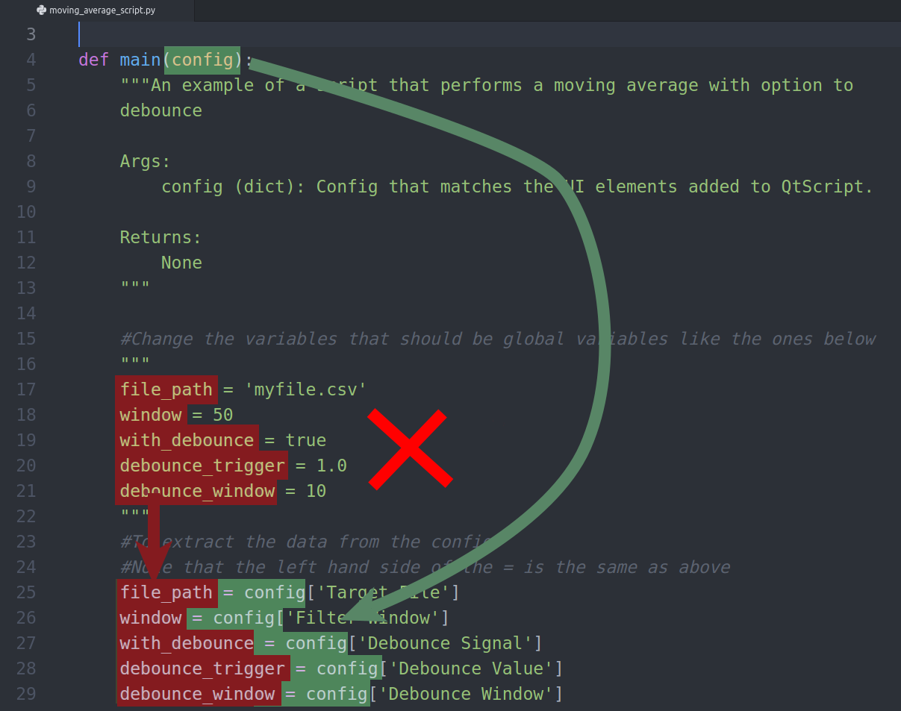
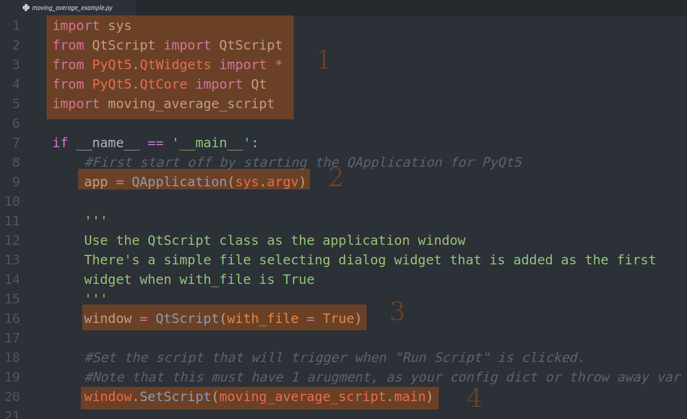
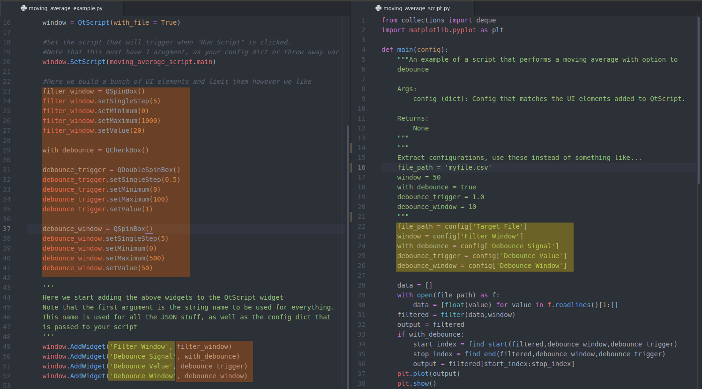
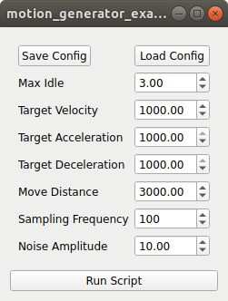
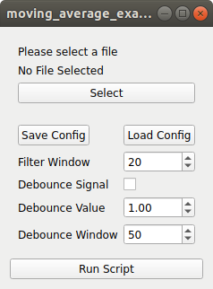
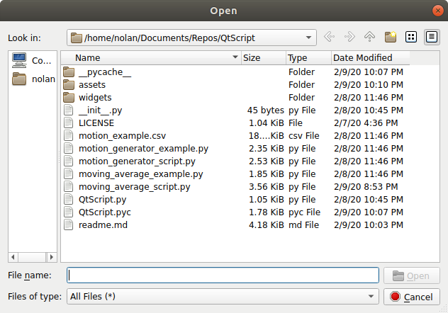
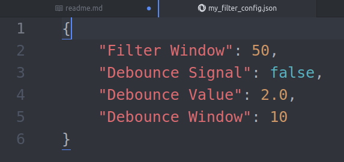

# Purpose
The intention of this project is to supply a very simple PyQt GUI to those who don't know much about programming, to take someone else's script and turn it into a reusable GUI.

# Definitions
**GUI** - Graphical User Interface

**PyQt/PyQt5** - A GUI framework in Python ported from C++ Qt

**Script** - A simple program that has more or less a single use case, but may require the user to change some "global" variables to make work correctly

**Widget/QWidget** - GUI elements that the user typically will interact with. QWidget is the name of the object in PyQt.

**Form Layout**- A type of widget layout in PyQt that allows 2 widget items to be added paired to each other. This causes a left and right column. For the purposes of this project, start by assuming left will be a label and right will be a user control widget.

# Scope (AKA excuses)
The idea for this project came from seeing scripts that are built by non-software engineers that are more or less single use only. In some cases, they are re-used by changing a handful of variables, most commonly the selected file. Windows in particular is strange because those who are not familiar with coding have errors with file paths containing backslashes "\\".

While I argue that the script writers should just learn to make simple GUI's or take arguments through the terminal, the easier, more passive aggressive, approach is just to take their scripts and dump them in a simple to use template.

This is not a tool that I spent a lot of time on, and many pieces were stripped and modified from other pieces of code I've written in the past. I will make periodic updates as required, but in general it is simple enough to get working if you follow the instructions in this read me. I also encourage you to actually learn Qt/PyQt as there's so much more functionality beyond what you see here.

## What you should be able to do:
* Use a button to open a file dialog, then select a file. The file should then be displayed so the user knows they selected the correct file.
* Add QWidgets with their respective labels to a form layout
* Easily save and load the current values in the widgets as if they were a configuration for commonly used variables in the script
* Easily get those values into the main script that's being called
* Be able to set a script that is called when a button is pressed, without having to teach the user about Slots and Signals

# Installation
Coming soon. I honestly at this point have forgotten how to use the Python build wheels and haven't created a setup file. Once I recall how to do this, I will do so and update this section. You do need to install PyQt5 first. I recommend looking up how to do it through official sources.

# Getting Started
1. Make sure you have PyQt5 installed
2. Find some script you want to make a simple GUI for
3. Stick the main component of the script into a function if it is not already
4. Change the values in your global variables to use a dictionary that is passed as an argument to this function
  * My recommendation is to leave the variable names as the script writer made it, then make the right hand side of the assignment equal to a value from your dictionary
5. Use descriptive names as strings as the keys for this dictionary. Think of names that you would like to show up on your GUI
6. Create a basic PyQt application (reference my examples if you do not know how to do this)
   1. Import sys, QtScript, PyQt5.Widgets, PyQt5.Core and your script from steps 2-4
   2. First start a PyQt application
   3. Create a QtScript window, and determine if you want to load a file or not by setting with_file = True or False
   4. Set the script being used when "Run Script" is clicked
   5. Create any desired PyQt Widgets, I will leave a few common ones in appendix below
   6. Optionally set some rules for your widgets such as min/max values
   7. Add these widgets to the QtScript object by using AddWidget(string('Label/Parameter name'), QWiget(object name))
   8. Show the widget and start the PyQt application

## Code Example
### Step 4

### Step 6.1 - 6.4

### Step 6.5-5.7

## Example GUIs
### Without File Selection

### With File Selection

### File Dialog

### Config Format

## Other References
PyQt's gallary for common widgets:
https://doc.qt.io/archives/qt-5.7/gallery.html
